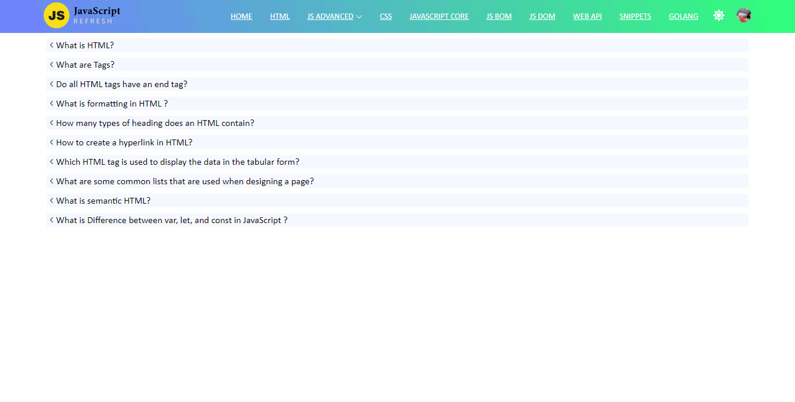
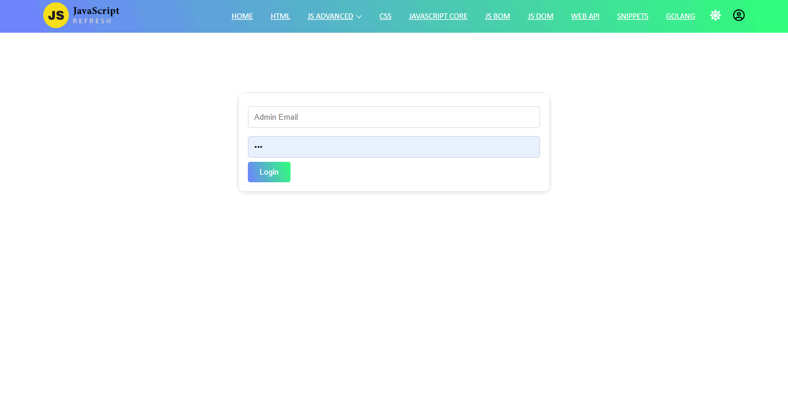
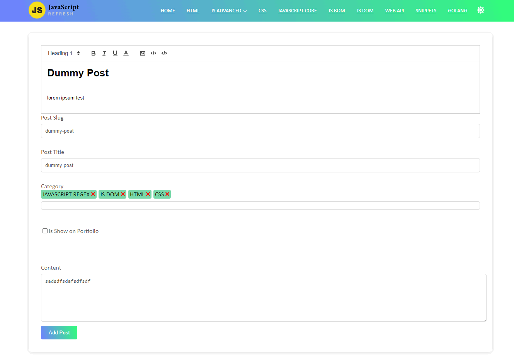

### JS-Interview app

MVC Pattern Like (Model, View and Controllers).

in views directory we have client side (preactjs) 

- index.js is our root server file
- app/index.js is our root application


#### For bundle we use esbuild. that extremely faster than other tools 


<br/>
To install all dependence 

```shell
npm install 
```


To Run dev server 

```shell
npm run dev
```

To Build for production Mode 

```shell
npm run build
```

Homepage


Login Page


Add Post Page
